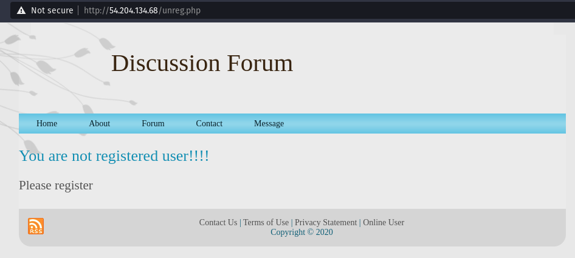
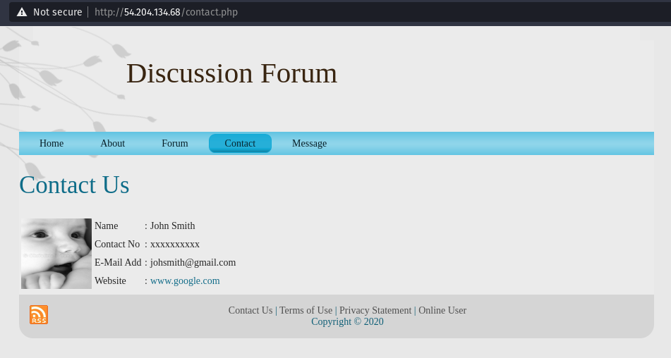
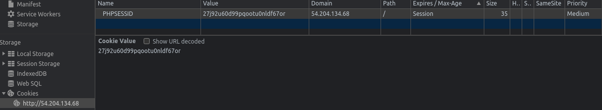

# Midterm Assignment
********************************
## Pre-Mission Steps
Hosted a staging server using express. 
********************************
## Information Gathering
### <u>Inital Briefing</u>
Recieved the following information from the briefing
1. Target IP: 54.204.134.68
2. WebServer running on Debian 4.19.181x86_64 
3. Fringe criminal group using targeted misinformation to shape public opinion

### <u>Basic Familiarization of Target</u>
1. Tried accessing the IP in a chromium-based browser, landed on a webpage (view the homepage below): 
2. Briefly investigated each of the pages and how the search bars reacted, nothing major just to see if there are any glaring mistakes and to become familiar with potential targets.

#### Evaluating the Webpage
Below are some screenshots of the pages available on the website and a brief overview of the features available

##### Homepage
A few text box fields worth investigating when looking for potential exploits.

##### Sign Up
Text box fields worth investigating for an exploit, in addition potential file upload point. May potentially be a way to upload a payload if it is functional and depending on restrictions.

##### About
Not much useful here other than some potential information on the structure.

##### Forum

##### Contact
Nothing of major note here. Link sends to free source code website rather than google.com. 

##### Message
Redirects to the homepage, nothing extra of interest.
##### Terms of use
Nothing of use noticed here.

##### Privacy Policy
Not much to see here. Does mention cookies.

##### Cookies
Value changes when opening in a new session. Potentially exploitable if generation method is discovered or admin session cookie compromised.

### <u>Network Enumeration</u>
#### Using nmap to survey open ports:
Used command `nmap -A 54.204.134.68`

Recieved the following output:
> Starting Nmap 7.91 ( https://nmap.org ) at 2021-04-01 16:45 CDT
> Nmap scan report for ec2-54-204-134-68.compute-1.amazonaws.com (54.204.134.68)
> Host is up (0.061s latency).
> Not shown: 997 filtered ports
> PORT    STATE SERVICE  VERSION
> 22/tcp  open  ssh      OpenSSH 7.9p1 Debian 10+deb10u2 (protocol 2.0)
> | ssh-hostkey: 
> |   2048 a6:78:9f:3f:6d:40:ba:69:5f:34:57:9d:f3:84:bb:dc (RSA)
> |   256 2b:b7:66:fb:fb:97:52:6c:00:b8:b2:72:85:a3:8f:33 (ECDSA)
> |_  256 2c:95:e0:91:d3:db:1b:bb:e3:88:8d:dc:cc:b4:35:ea (ED25519)
> 80/tcp  open  http     Apache httpd 2.4.46 ((Unix) OpenSSL/1.1.1d)
> |_http-server-header: Apache/2.4.46 (Unix) OpenSSL/1.1.1d
> |_http-title: Online Discussion Forum
> 443/tcp open  ssl/http Apache httpd 2.4.46 ((Unix) OpenSSL/1.1.1d)
> |_http-server-header: Apache/2.4.46 (Unix) OpenSSL/1.1.1d
> |_http-title: Online Discussion Forum
> | ssl-cert: Subject: commonName=example.com
> | Not valid before: 2012-11-14T11:18:27
> |_Not valid after:  2022-11-12T11:18:27> 
> Service Info: OS: Linux; CPE: cpe:/o:linux:linux_kernel
> 
> 
> Service detection performed. Please report any incorrect results at https://nmap.org/submit/ .
> Nmap done: 1 IP address (1 host up) scanned in 22.09 seconds

**Note the following about the above output:** 
1. Ports 22/tcp, 80/tcp, and 443/tcp are open
    1. 22/tcp
        a. Service: ssh
        b. Version: OpenSSH 7.9p1 Debian 10+deb10u2 (protocol 2.0)
        c. SSH-Hostkeys
    2. 80/tcp
        a. Service: http
        b. Version: Apache httpd 2.4.46 ((Unix) OpenSSL/1.1.1d)
        c. Hosting: Online Discussion Forum
    3. 443/tcp
        a. Service: ssl/http
        b. Version: Apache httpd 2.4.46 ((Unix) OpenSSL/1.1.1d)

********************************

