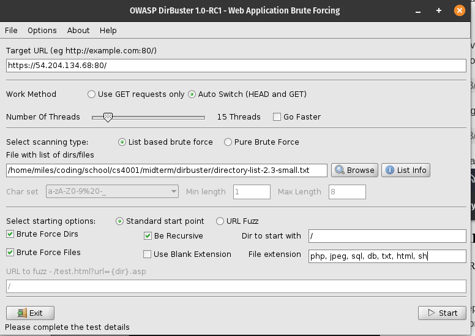

# Midterm Assignment
Note: Any occurences of the Base/C2 IP(s) will be redacted from any documentation or script in this repo.
********************************
## Pre-Mission Steps
Hosted a staging server using express/nodejs. However, this was never used.
To run:
1. Download the file [StagingServer.js](src/StagingServer.js) file
2. Access the directory where it was downloaded
3. Change the PORT, to the port you wish to direct traffic through. This port must be open on the device, and if necessary, port forwarded to the device by the network's router.
4. In the command line run `npm install express` and `npm install node`
5. Run `node StagingServer.js` to start the staging server.
********************************
********************************
## Information Gathering
#### <u>Inital Briefing</u>
Recieved the following information from the briefing
1. Target IP: REDACTED_TARGET_IP
2. WebServer running on Debian 4.19.181x86_64 
3. Fringe criminal group using targeted misinformation to shape public opinion

#### <u>Basic Familiarization of Target</u>
1. Tried accessing the IP in a chromium-based browser, landed on a webpage (view the homepage below): 
2. Briefly investigated each of the pages and how the search bars reacted, nothing major just to see if there are any glaring mistakes and to become familiar with potential targets.

#### Evaluating the Webpage
Below are some screenshots of the pages available on the website and a brief overview of the features available

#### Homepage
A few text box fields worth investigating when looking for potential exploits.

#### Sign Up
Text box fields worth investigating for an exploit, in addition potential file upload point. May potentially be a way to upload a payload if it is functional and depending on restrictions.

The Image upload file gave no notice of errors when images, text, nor php files. The files found in /src/test-uploads are the files that were uploaded.
> Uploaded Files:
> 58fc1d72bfbfb_ProperIconForDiscord.png
> download (1).jpeg
> download.jpeg
> e.php

#### About

Not much useful here other than some potential information on the structure.

#### Forum
Nothing of use here without an account it seems.

#### Contact

Nothing of major note here. Link sends to free source code website rather than google.com. 

#### Message (Button)
Redirects to the homepage, nothing extra of interest.
#### Terms of use
Nothing of use noticed here.

#### Privacy Policy

Not much to see here. Does mention cookies.

#### Cookies

Value changes when opening in a new session. Potentially exploitable if generation method is discovered or admin session cookie compromised.

#### Non-Functional Login

When attempting to login with a user created account, no success was had. Even after attempting a newly created account, including with burner emails (recieved nothing), trying to log in would always result in "Invalid User Id / password". In all likelihood, this is either poorly or yet to be implemented.

### <u>Network Enumeration</u>
#### Using nmap to survey open ports:
Used command `nmap -A REDACTED_TARGET_IP`

Recieved the following output:
> Starting Nmap 7.91 ( https://nmap.org ) at 2021-04-01 16:45 CDT
> Nmap scan report for ec2-54-204-134-68.compute-1.amazonaws.com (REDACTED_TARGET_IP)
> Host is up (0.061s latency).
> Not shown: 997 filtered ports
> PORT    STATE SERVICE  VERSION
> 22/tcp  open  ssh      OpenSSH 7.9p1 Debian 10+deb10u2 (protocol 2.0)
> | ssh-hostkey: 
> |   2048 a6:78:9f:3f:6d:40:ba:69:5f:34:57:9d:f3:84:bb:dc (RSA)
> |   256 2b:b7:66:fb:fb:97:52:6c:00:b8:b2:72:85:a3:8f:33 (ECDSA)
> |_  256 2c:95:e0:91:d3:db:1b:bb:e3:88:8d:dc:cc:b4:35:ea (ED25519)
> 80/tcp  open  http     Apache httpd 2.4.46 ((Unix) OpenSSL/1.1.1d)
> |_http-server-header: Apache/2.4.46 (Unix) OpenSSL/1.1.1d
> |_http-title: Online Discussion Forum
> 443/tcp open  ssl/http Apache httpd 2.4.46 ((Unix) OpenSSL/1.1.1d)
> |_http-server-header: Apache/2.4.46 (Unix) OpenSSL/1.1.1d
> |_http-title: Online Discussion Forum
> | ssl-cert: Subject: commonName=example.com
> | Not valid before: 2012-11-14T11:18:27
> |_Not valid after:  2022-11-12T11:18:27> 
> Service Info: OS: Linux; CPE: cpe:/o:linux:linux_kernel
> 
> 
> Service detection performed. Please report any incorrect results at https://nmap.org/submit/ .
> Nmap done: 1 IP address (1 host up) scanned in 22.09 seconds

**Note the following about the above output:** 
1. Ports 22/tcp, 80/tcp, and 443/tcp are open
    1. 22/tcp
        a. Service: ssh
        b. Version: OpenSSH 7.9p1 Debian 10+deb10u2 (protocol 2.0)
        c. SSH-Hostkeys
    2. 80/tcp
        a. Service: http
        b. Version: Apache httpd 2.4.46 ((Unix) OpenSSL/1.1.1d)
        c. Hosting: Online Discussion Forum
    3. 443/tcp
        a. Service: ssl/http
        b. Version: Apache httpd 2.4.46 ((Unix) OpenSSL/1.1.1d)

********************************
********************************

## Finding an Exploit

### <u>Command Injections</u>
Used various text boxes and the url bar to make naive attempts to inject SQL/shell commands. IE, simple things like adding ticks and single quotes followed by SQL commands or adding a semicolon followed by a shell command. There were no apparent advantages from these attempts, not much information was passed to the user from these.

### <u>Directory Traversal</u>
Attempting to find more information via directory traversal. 

##### Initial Attempts
Tried accessing various positions in the url to see if directory traversal would be possible. 
Naive attempts to access things like
> REDACTED_TARGET_IP/../../../../../../etc/debian_version

 Which was changed to

> REDACTED_TARGET_IP/etc/debian_version

Did not result in anything useful outside of the following standard Apache server 404 response

Also tried intercepting the packet using BurpeSuiteCommunity and editted the packet to edit the GET HTTP request from 
> GET /etc/debian_version

to

> GET /../../../../../../../etc/debian_version

Also unfruitful, recieved the typical Apache 400 Error Bad Request page

### <u>Exploring the HTTP Service Deeper</u>
Noting that the url contained the file that it was accessing, there was potential for accessing the files that the user would upload, this means there was potential to use the files that were uploaded earlier, or in future, to gain access to the server. However, this requires knowing where the files are uploaded, and using a php script to execute a payload. In addition, the payload must be accepted by the server, meaning files formats and sizes are limited to whatever the form would accept. However, there were no errors when uploading the php file earlier, so this method looked hopeful if the files could be located and accessed by the end user.

#### Finding the User Uploaded Files
Some naive attempts to access the files failed.

Eventualy, OWASP DirBuster was used on the webserver on port 80 (http://REDACTED_TARGET_IP:80) to potentially discover where the user files are stored.

Ran DirBuster with the following settings:

While there were some potentially useful finds, such as an /phpmyadmin directory which results in the following response when attempting to access http://REDACTED_TARGET_IP/phpmyadmin :
> For security reasons, this URL is only accessible using localhost (127.0.0.1) as the hostname.

the main point was to find the user uploaded files. Which was found in the /ups directory. This was noticed when DirBuster found these files: 

Upon investigating this directory, the following was seen

and in observing the files matching the names of those that were uploaded earlier, it was clear that they matched as seen below:

download.png:

hello.txt:

e.php:

Important to note that it seems that the php ls query did not show all files in the directory; however it was worth investigating this further to see if an uploaded php file could execute a payload uploaded in the same directory. In addition, this was good news, as it meant multiple file formats were accepted.

#### Attempting to create a reverse shell with this method
The payload file [dog.sh](src/dog.sh) was uploaded along with [lettuce.php](src/lettuce.php) in attempts to make a reverse shell; This was generated using the same [payload generator]() from the first mission. This payload was mainly built for systems that have minimal support for various tools or languages, such as the typical android device. However, it seemed that under these circumstances, when executed by the php script the first terminal immediately terminates and only the second terminal (the recipient) persists in its connection. Thus commands would not be enterable. See below for a photo of the terminals.

#### Attempting to create the shell with php
In order to resolve this issue, the reverse shell was made in pure with PHP. A listener was set up on the local machine using 

> `nc -w 100 -nlvp 8000` (Note that -w 100 is optional timeout, post initial connection this was left out)

And a new payload [lettucev2.php](src/lettucev2.php) was uploaded to the server. And there was a successful connection when accessed via http://REDACTED_TARGET_IP/ups/lettucev2.php. 
 Below is a successful connection on the terminal:

 

Payloads can now be sent to the server reliably as needed. 
********************************
********************************
## Findings

### <u>Saved Web Pages</u>
There were some interesting web pages that were saved in the /home/bitnami directory.

Three of these were saved from the anarchist library:

[crimethinc-from-democracy-to-freedom](files/From%20Democracy%20To%20Freedom%20_%20The%20Anarchist%20Library.html)

[subcowmandante-marcos-hack-back](files/Hack%20Back%20_%20The%20Anarchist%20Library.html)

[voltairine-de-cleyre-the-gods-and-the-people](files/The%20Gods%20and%20the%20People%20_%20The%20Anarchist%20Library.html)

As well as a page from the [Android Software Development Wiki](files/Android%20software%20development%20-%20Wikipedia.html)

### <u>Other Findings</u>

[SQL File](files/tech_forum.sql) for answer found in https://REDACTED_TARGET_IP/db/tech_forum.sql

In addition there were phpmyadmin and mysql directories suggesting that the backend of this discussion form will be done with mysql.

These files lead to suggest that the rest of the backend for the user forms will be finished and implemented using mysql.

### Conclusions from Findings.

There is evidence that the group has at least some anarchist sympathies. In addition, there's some likelyhood that some android app is in development as seen in the saved Android Development wiki page. Furthermore, it's likely that the seemingly non-functional user-signup and forumn portions of the website will be fleshed out as evidenced by the sql file, phpmyadmin, and mysql directories.
